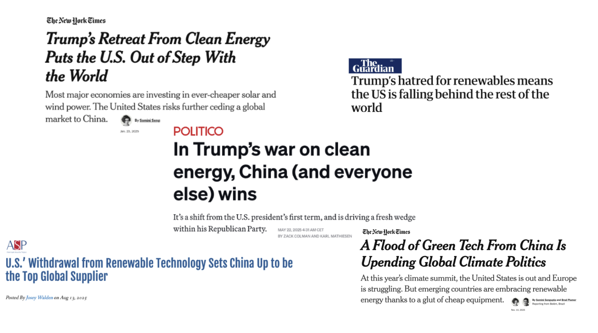
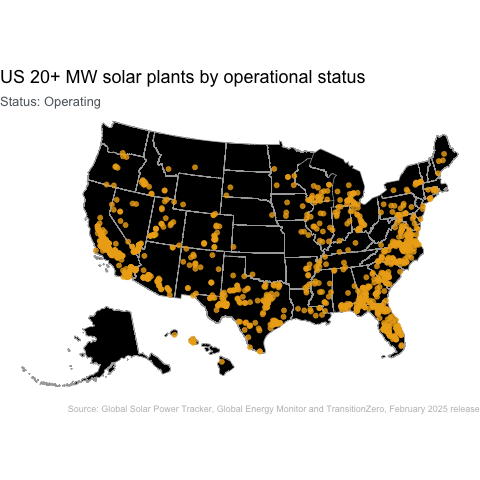
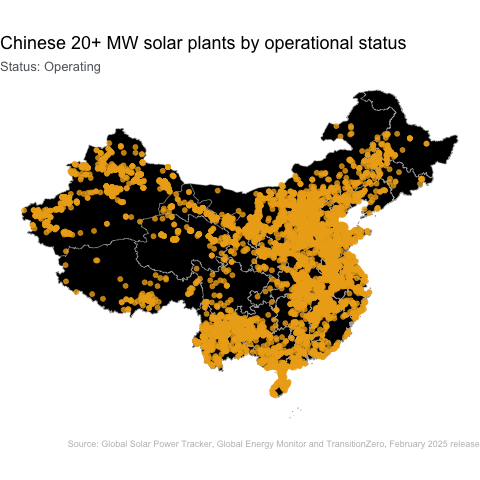

## Making America Weak: Consequences of Underinvestment in Renewable Energy {.smaller}



This project was inspired by The New York Times *Power Moves* article: [*There's a Race to Power the Future. China is Pulling Away.*](https://www.nytimes.com/interactive/2025/06/30/climate/china-clean-energy-power.html)

## The United States Lags Behind it's Peers

```{r}
# load libraries
library(tidyverse)
library(readxl)
library(janitor)
library(ggtext)
library(sf)
library(tigris)
library(rnaturalearth)
library(rnaturalearthdata)
library(patchwork)
library(ggtext)
library(plotly)
library(gganimate)

# load data 
#------------------------------------------------------------------------------#
# IRENA  ----
#------------------------------------------------------------------------------#

irena <- read_excel(
    'data/IRENA_Statistics_Extract_2025H2.xlsx',
    sheet = 'Country'
) %>%
    janitor::clean_names()

#------------------------------------------------------------------------------#
# Solar  ----
#------------------------------------------------------------------------------#

solar_power_20mw <- read_xlsx('~/Desktop/dataviz/final_project/data/Global-Solar-Power-Tracker-February-2025.xlsx', sheet = '20 MW+') %>%
    janitor::clean_names() %>%
    st_as_sf(coords = c('longitude','latitude'), crs = 4326)

# Create status_group variable 
solar_power_20mw <- solar_power_20mw %>%
    mutate(status_group = case_when(
        status %in% c('shelved','mothballed','retired','cancelled','cancelled - inferred 4 y','shelved - inferred 2 y') ~ 'Excluded',
        status %in% c('operating') ~ 'Operating',
        status %in% c('announced') ~ 'Announced',
        status %in% c('construction','pre-construction') ~ 'In construction',
        TRUE ~ status ))

#------------------------------------------------------------------------------#
# IEA energy investment  ----
#------------------------------------------------------------------------------#

# IEA (2025), Energy investment across regions and sectors, 2015 and 2025, IEA, Paris https://www.iea.org/data-and-statistics/charts/energy-investment-across-regions-and-sectors-2015-and-2025, Licence: CC BY 4.0

# data in billion USD (2024, MER)
# 2025 values estimated


iea <- read_csv('data/iea_2025_inv_by_region.csv')

colors <- list(
    celtic_green = "#008348"
    , dark_green = "#265436"
    , mint_green = "#BADDC9"
    , middle_green = "#799A84"
    , golden = "#EDAB18"
    , text_gray = "#5D6770"
    , navy = "#003D52"
)

```

```{r}
#| label: ranking 

## get world sf from rnaturalearth
world_sf <- ne_countries(
  #scale = "medium", 
  returnclass = "sf"
) %>%
    mutate( iso3_code  = str_trim(str_to_upper(adm0_a3_us)))

world_sf_data <- world_sf %>%
    as.data.frame() %>%
    select(iso3_code, name_en, pop_est, pop_year, gdp_md, gdp_year, economy, income_grp, continent, subregion, region_un) %>%
    unique()

## World map of % renewable energy generation 2023 

irena_bc <- irena %>%
    filter(year == 2023) %>%

    group_by(country,iso3_code, region, re_or_non_re) %>%
    summarise(ttl_energy_generation_by_re_non_re = sum(electricity_generation_g_wh, na.rm = TRUE))  %>% 

    group_by(country) %>%
    mutate(ttl_energy_generation_by_country = sum(ttl_energy_generation_by_re_non_re, na.rm = TRUE)) %>% 

    ungroup() %>%
    mutate(pct_renewable = ttl_energy_generation_by_re_non_re/ttl_energy_generation_by_country,
           is_usa = ifelse(
            iso3_code=='USA',TRUE, FALSE
           ),
           iso3_code = str_trim(str_to_upper(iso3_code))) %>%
        
    filter(re_or_non_re=='Total Renewable', 
           !iso3_code %in% c('XOC','XMX','XME','XLA','XDX','XCS','XAS','XAF','XAA')) %>%
    arrange(desc(pct_renewable)) 

world_sf <- world_sf %>%
    merge(
        irena_bc,
        by = 'iso3_code',
        all.x = TRUE
    ) %>%
    mutate(label_text = str_c(
        name_en, 
        ": ", 
        scales::percent(
            pct_renewable, 
            accuracy =.1
            )
        ))

irena_bc <- irena_bc %>%
    merge(
        world_sf_data,
        by = 'iso3_code',
        all.x = TRUE
    )


## bar chart showing how behind US is 

irena_bc_um_hi <- irena_bc %>%
    select(name_en,pct_renewable,income_grp) %>%
    filter(income_grp %in% c('1. High income: OECD','2. High income: nonOECD','3. Upper middle income')) %>%
    filter(!is.na(pct_renewable)) %>%
    mutate(rank = rank(-pct_renewable),
            is_usa = ifelse(name_en=='United States of America', TRUE, FALSE),
            label_text = str_c(
                name_en,
                ": ",
                scales::percent(
                    pct_renewable, 
                    accuracy =.1
            )
            )) 


rankplot <- irena_bc_um_hi %>%
    ggplot(aes(x = pct_renewable, 
               y = forcats::fct_reorder(name_en, pct_renewable), 
               fill = is_usa,
               text = label_text)
               ) +
    geom_col() +
    scale_fill_manual(values = c('black',colors$golden)) +
    scale_x_continuous(label = scales::percent_format())+
    labs(y = "",
         x = "% Energy Generation from Renewable Energy",
         title = "The US ranks <span style='color:#EDAA1C;'>68th</span> among high and upper middle income countries",
         #subtitle = "in terms of energy generation from renewable sources, 2023",
         caption = "source: IRENA")+
    theme_minimal() +
    theme(
        plot.title = element_text(face = "bold", size = 11),
        plot.subtitle = element_text(face = "italic", size = 6),
        plot.caption = element_text(face = "italic", size = 6),
        legend.position = 'none',
        panel.grid.major = element_blank(),
        axis.text.y = element_text(size =4)
    )

ggplotly(rankplot, tooltip = "label_text") %>%
    layout(
        hovermode = "x",
        font = list(
        family = "Helvetica",
        size = 12
        ),
        annotations = list(
        list(
        text = "in terms of energy generation from renewable sources, 2023",
        x = 0.005,
        y = 1.038,
        xref = "paper",
        yref = "paper",
        showarrow = FALSE,
        font = list(size = 12)
        )
    ),
        autosize = TRUE, 
        width = NULL
)

```


## Global Positioning {.scrollable}
```{r}
#| label: world-map 

wm <- ggplot(data = world_sf, aes(text = label_text)) +
  geom_sf(aes(fill = pct_renewable), color = "white", linewidth = 0.1) +
  scale_fill_gradient(name = "% Energy from Renewable Sources", 
                      low = "black", 
                      high = colors$golden,
                      guide = guide_colorbar(
                            barwidth = unit(0.5, "cm"), 
                            barheight = unit(5, "cm") ,
                            direction = 'horizontal'
                            ),
                       labels = scales::percent_format()
                    ) + 
  theme_void() +
  labs(
    title = "The United States is in the <span style='color:#EDAA1C;'>bottom half</span> of countries, globally",
    subtitle = "2023",
    caption = "Source: IRENA"
  )+
  theme (legend.position = "bottom",
        plot.title = element_text(face = "bold", size = 11),
        plot.subtitle = element_text(face = "italic", size = 6),
        plot.caption = element_text(face = "italic", size = 6),
  )

g <- ggplotly(wm, 
         tooltip = "label_text",
         width = 800, 
         height = 500) %>%
        layout(
            font = list(
                family = "Helvetica",
                size = 12
            )
         )


  # handle trace$marker$colorbar (common for scatter-type traces)
# ensure g exists (your ggplotly object)
for (i in seq_along(g$x$data)) {
  tr <- g$x$data[[i]]

    if (!is.null(tr$marker) && !is.null(tr$marker$colorbar)) {
        g$x$data[[i]]$marker$colorbar$orientation <- "h"
        g$x$data[[i]]$marker$colorbar$x <- 0.5
        g$x$data[[i]]$marker$colorbar$y <- -0.15
        g$x$data[[i]]$marker$colorbar$xanchor <- "center"
        g$x$data[[i]]$marker$colorbar$len <- 0.6
        g$x$data[[i]]$marker$colorbar$thickness <- 10
        g$x$data[[i]]$marker$colorbar$title <- list(text = "% Energy from Renewable Sources", side = "bottom")
    }
}

g <- g %>% layout(
        font = list(family = "Helvetica", size = 12),

        annotations = list(
            list(
                text = "in terms of energy generation from renewable sources, 2023",
                x = 0.005,
                y = 1.025,
                xref = "paper",
                yref = "paper",
                showarrow = FALSE,
                font = list(size = 12)
            )
    )
)

g

```

```{r}
#| label: boxplo

bp <- irena_bc_um_hi %>%
    ggplot(aes(x = " ", 
               y = pct_renewable)) +
    
    geom_boxplot(outlier.shape = NA) +
    
    geom_jitter(aes(color = is_usa, 
                    size = is_usa,
                    text = label_text),
                width = 0.2) + 
    
    scale_color_manual(values = c("TRUE" = colors$golden, "FALSE" = "black")) +
    

    scale_y_continuous(labels= scales::percent_format(), breaks = c(0,.5,1)) + 
    scale_size_manual(values = c("TRUE" = 3, "FALSE" = 1)) +
    

    labs(y = "% Energy Generation from Renewable Energy",
         x ="") +
    

    coord_flip() +
    
    theme_minimal()+
    theme(
        legend.position = 'none',
        panel.grid.minor = element_blank(),
        axis.text.y = element_blank() 
    )


ggplotly(bp, tooltip = "text") %>% layout(
        font = list(family = "Helvetica", size = 12),
        autosize = TRUE, width = NULL )

```


## China has made deep investments, especially in solar {.smaller .scrollable}

::: {.panel-tabset}

### Operating Plants
```{r results = 'hide'}
#| label: solar-development-comp

# Load US States map
state <- tigris::states() %>%
    # Filter out territories
    filter(as.numeric(STATEFP) < 60)

# Set CRS 
state <- st_transform(state, 4326)

# Consolidate states 
state <- state %>% shift_geometry()

# Load China map 
china_regions <- ne_states(country = "China", returnclass = "sf")

# Set CRS 
china_regions <- st_transform(china_regions, 4326)

```
```{r}

us_20 <- solar_power_20mw %>%
    filter(country_area %in% c('United States'),
          is.na(retired_year),
          status_group == 'Operating') %>%
          shift_geometry()

chn_20 <- solar_power_20mw %>%
    filter(country_area %in% c('China'),
          is.na(retired_year),
          status_group == 'Operating')

# Create US plot
us <- ggplot() +
    geom_sf(data = state, 
            fill ="black", 
            color = "darkgray") +
    geom_sf(data = us_20, 
            alpha =.7,
            color = "#EDAB18") +
    theme_void()

# Create China plot
chn <- ggplot() +
    geom_sf(data = china_regions, 
            fill ="black", 
            color = "darkgray") +
    geom_sf(data = chn_20, 
            alpha =.7,
            color = "#EDAB18") +
    theme_void()


# Define comparison metrics
ttl_capacity_chn <- sum(chn_20$capacity_mw, na.rm = TRUE) 
ttl_capacity_us <- sum(us_20$capacity_mw, na.rm = TRUE) 

n_chn <- nrow(chn_20)
n_us <- nrow(us_20)

ttl_cap_comp <- round(ttl_capacity_chn/ttl_capacity_us)
n_comp <- round(n_chn/n_us)


# Write out subtitle
subtitle_ <- paste0(
  "China has <span style = 'color:#EDAB18;font-weight:bold;'>",
  n_comp,
  "X </span>", 
  "the number of 20+ MW solar plants as the US, producing <span style = 'color:#EDAB18;font-weight:bold;'>",
  ttl_cap_comp,
  "X</span>", 
  " the amount of energy"
)
```

<span style ="font-weight:bold;size=16;"> `r paste0(
      subtitle_,
      "<br><span style='color:gray;size:9;'>Note: A 20 MW+ solar plant is a utility-scale plant.</br></span>")` </span>

 

```{r}
#| dpi: 150
#| fig-align: left

# Combine US and China Plots 
(us / chn) + 
    # Annotate combined plots 
    plot_annotation(
    title = 'Operating 20+ MW solar plants in the US and China',
    caption = 'Source: Global Solar Power Tracker, Global Energy Monitor and TransitionZero, February 2025 release',
    theme = theme(
        plot.title = element_text(face = "bold", size = 11),
        plot.caption = element_text(size = 6,  color = "gray")
    ))
```

### US Investments

```{r eval = FALSE}
#| label: create-datasets
# Create datasets 

us_20 <- solar_power_20mw %>%
    filter(country_area %in% c('United States'),
          is.na(retired_year),
          status_group!='Excluded') %>%
          shift_geometry()

chn_20 <- solar_power_20mw %>%
    filter(country_area %in% c('China'),
          is.na(retired_year),
          status_group!='Excluded')

```


```{r eval = FALSE}
#| label: us-plot-status
us_points <- us_20 %>% 
  mutate(
    x = st_coordinates(.)[,1],
    y = st_coordinates(.)[,2],
    status_group  = factor(
      status_group,
      levels = c("Operating",'In construction','Announced')
    )
  ) %>%
  st_drop_geometry()


us <- ggplot() +
  geom_sf(data = state, fill = "black", color = "darkgray") +
  geom_point(data = us_points, 
             aes(x = x, y = y, color = status_group),
            alpha = 0.8, size = 2) +
  scale_color_manual(values = c(
    "Operating" = "#EDAB18",
    "In construction" = "#00B200",
    "Announced" = "#FF4D4D"
  ), )+
  theme_void() +
  transition_states(status_group,
  transition_length = 2, 
  state_length = 1) +
  shadow_mark(past = TRUE, future = FALSE, alpha = 0.6) +
  labs(title = "US 20+ MW solar plants by operational status",
    subtitle = "Status: {closest_state}",
    caption = 'Source: Global Solar Power Tracker, Global Energy Monitor and TransitionZero, February 2025 release') + 
  theme(
    plot.title = element_text(face = "bold", size = 18),
    plot.subtitle = element_markdown(size = 13, color = "#5D6770",  lineheight = 0.9),
    plot.caption = element_text(size = 9,  color = "gray"),
    legend.position = "none"
  )

animate(us)
anim_save("us_status_animated.gif")
```

```{r eval = FALSE}
#| label: china-plot
chn_points <- chn_20 %>% 
  mutate(
    x = st_coordinates(.)[,1],
    y = st_coordinates(.)[,2],
    status_group  = factor(
      status_group,
      levels = c("Operating",'In construction','Announced')
    )
  ) %>%
  st_drop_geometry()


chn <- ggplot() +
  geom_sf(data = china_regions, fill = "black", color = "darkgray") +
  geom_point(data = chn_points, 
             aes(x = x, y = y, color = status_group),
            alpha = 0.8, size = 2) +
  scale_color_manual(values = c(
    "Operating" = "#EDAB18",
    "In construction" = "#00B200",
    "Announced" = "#FF4D4D"
  ))+
  theme_void() +
  transition_states(status_group,
  transition_length = 2, 
  state_length = 1) +
  shadow_mark(past = TRUE, future = FALSE, alpha = 0.6) +
  labs(title = "Chinese 20+ MW solar plants by operational status",
    subtitle = "Status: {closest_state}",
    caption = 'Source: Global Solar Power Tracker, Global Energy Monitor and TransitionZero, February 2025 release') + 
  theme(
    plot.title = element_text(face = "bold", size = 18),
    plot.subtitle = element_markdown(size = 13, color = "#5D6770",  lineheight = 0.9),
    plot.caption = element_text(size = 9,  color = "gray"),
    legend.position = "none"
  )

animate(chn)
anim_save("chn_status_animated.gif")
```
```{r}
#| label: us-gif
#| dpi: 150

```
### Chinese Investments
```{r}
#| label: chn-gif
#| dpi: 150

```
:::

## Pulling back on federal investments will further erode our global standing 
::: {.panel-tabset}
### 2025
```{r}
iea_pivot <- iea %>%
    pivot_longer(!c(region,year),names_to='industry',values_to = "usd_billions") %>%
    mutate(year = as.factor(year),
            to_highlight = ifelse(region %in% c('China','United States'), TRUE, FALSE))

chn_25 <- iea_pivot %>%
    filter(industry=='renewable_power', year==2025, region=='China') %>%
    pull(usd_billions)

us_25 <- iea_pivot %>%
    filter(industry=='renewable_power', year==2025, region=='United States') %>%
    pull(usd_billions)

pct_diff <- scales::percent((chn_25-us_25)/chn_25, accuracy = .1)

# Write out subtitle
title_ <- paste0(
  "China invested ",
  pct_diff, 
  " more in renewable energy than the US in 2025"
)

iea_pivot %>%
    filter(industry=='renewable_power', year==2025)%>%
    ggplot(aes(y=forcats::fct_reorder(region,usd_billions), x=usd_billions, fill = to_highlight)) +
    geom_bar(position="dodge", stat="identity") +
    scale_fill_manual(values = c('black',colors$golden)) +
    labs(y="",
         x = "USD (Billions)",
         title = title_,
         caption = "Source: International Energy Agency") + 
    theme_minimal() +
    theme(
        plot.title = element_text(face = "bold", size = 11),
        plot.subtitle = element_markdown(size = 6, color = "#5D6770",  lineheight = 0.9),
        plot.caption = element_text(size = 6,  color = "gray"),
        legend.position = "none"
    )
```
### Widening Gap
```{r}
# Wrangle data for viz
renew_slope_chart <- iea_pivot %>%
    # filter boundary crossing regions
    filter(region %in% c('United States','China'), industry=='renewable_power') %>%
    # select only necessary columns
    select(region, year, usd_billions) %>%
    # group by region for calculation
    group_by(region) %>%
    # calculate YOY % chg 
    mutate( pct_chg = scales::percent((usd_billions-lag(usd_billions))/lag(usd_billions),accuracy=.1))
```

```{r}
#| fig-width: 20
#| fig-height: 18
# Create slope viz

# Create label for lines 
g_label_l <- renew_slope_chart %>%
  filter(year == '2025', region %in% c('United States','China'))

# Create annotations for viz
# pull % chg for china
china_annotation <- renew_slope_chart %>% 
    filter(region == 'China' & year =='2025') %>%
    select(pct_chg) %>%
    pull()

# Write out annotation
china_label_text <- paste0(
  "China increased investment in renewable energy by ",
  "<b>", china_annotation, "</b>",
  " between 2015 and 2025"
)

# Wrap label
china_wrapped_label <- str_wrap(china_label_text, width = 25)

# Substitute different line break characters to work with richtext 
china_wrapped_label <- gsub("\n", "<br>", china_wrapped_label)

# pull % chg for US
us_annotation <- renew_slope_chart %>% 
    filter(region == 'United States' & year =='2025') %>%
    select(pct_chg) %>%
    pull()

# Write out annotation
us_label_text <- paste0(
  "While the United States increased investment in renewable energy by ",
  "<b>", us_annotation, "</b>",
  " between 2015 and 2025"
)

# Wrap label
us_wrapped_label <- str_wrap(us_label_text, width = 25)

# Substitute different line break characters to work with richtext
us_wrapped_label <- gsub("\n", "<br>", us_wrapped_label)

```
```{r}
# Viz 
renew_slope_chart %>%
    filter(region %in% c('United States','China')) %>%
    ggplot( aes(as.numeric(year), usd_billions, color = region)) +
        geom_line(linewidth = 3) +
        geom_label(aes(label = usd_billions), fill = "white", label.size = 0) + 
        geom_text(data = g_label_l, aes(label = region, x = as.numeric(year) - 0.005), hjust = 1, vjust =-.9) +
        annotate(
            geom = "richtext",
            x = 1.9, y = 250,
            label = china_wrapped_label,
            size = 3,
            color = "#5D6770",
            fill = NA,        
            label.color = NA  
        ) +
        annotate(geom = "richtext", 
                    x = 1.9,
                    y = 45,
                    label = us_wrapped_label, size =3, color ="#5D6770",
                    fill = NA,       
                    label.color = NA) +
        labs(title="The investment gap between the US and China is widening", 
            subtitle="Investment in renewable energy (USD Billions)", 
            caption="Source: International Energy Agency",
            x = "Year",
            y = ""
            ) +
        scale_x_continuous(#limits = c(2015, 2025),  
                             breaks = c(1, 2),
                             labels = c(2015, 2025)
                             ) + 
        scale_y_continuous(limits = c(0, 350)
         ) + 
        scale_color_manual(values = c(
            "China" = colors$golden,
            "United States" = "black")
            )+
        theme_minimal() +
        theme(legend.position = "none",
                panel.grid.major.y = element_blank(), 
                panel.grid.minor = element_blank(), 
                axis.line.y = element_blank(), 
                axis.ticks.y = element_blank(),
                axis.text.y = element_blank(),
                axis.text.x = element_text(size=16, face ="bold"),
                plot.title = element_text(face = "bold", size = 11),
                plot.subtitle = element_markdown(size = 8, color = "#5D6770",  lineheight = 0.9),
                plot.caption = element_text(size = 9,  color = "gray"))


```
:::
## Going forward {.smaller}

In order to keep America great, we need to be looking forward, not back. This means investing in basic science and new techonological development, not relying on our current dominance in fossil fuels. 

Further investigation into China's lead in developing and manufacturing renewable energy technology and the economic and political benefits accrued by exporting these tools should be conducted

## Additional Resources

<span style = 'size:16;'>[**Click here to compare the US to other countries**](https://sarah-mathey.shinyapps.io/shiny_app/)</span>

<span style = 'size:16;'>[**Use this link to explore this work on your own**](https://sarahmathey.github.io//data_viz//peer-review)</span>


## Data Sources {.smaller}

* IEA (2025), Energy investment across regions and sectors, 2015 and 2025, IEA, Paris https://www.iea.org/data-and-statistics/charts/energy-investment-across-regions-and-sectors-2015-and-2025, Licence: CC BY 4.0

* IRENA (2025), Renewable Energy Statistics 2025, International Renewable Energy Agency, Abu Dhabi. https://www.irena.org/Publications/2025/Jul/Renewable-energy-statistics-2025

* Global Solar Power Tracker, Global Energy Monitor and TransitionZero, February 2025 release. https://globalenergymonitor.org/wp-content/uploads/2025/02/Global-Solar-Power-Tracker-February-2025.xlsx